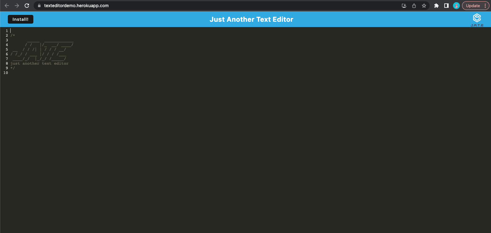

# 19TextEditor

This is a single-page Progressive Web App (PWA) that allows users to edit text documents in the browser. The app is designed to function offline and features multiple data persistence techniques that provide redundancy in case one option is not supported by the browser.

The application is built using an existing codebase and uses the `idb` package, a lightweight wrapper around the IndexedDB API, to implement methods for getting and storing data in an IndexedDB database.

## Links
* Github Repo: https://github.com/bryxzi/19TextEditor
* Heroku Deployment: https://texteditordemo.herokuapp.com

## Demo

## Getting Started

To run this project, you will need Node.js and NPM installed on your machine.

1. Clone this repository to your local machine.
2. Navigate to the `text-editor` directory.
3. Install dependencies for both the client and server by running `npm install` in both directories.
4. Start the server by running `npm start` in the `server` directory.
5. Start the client by running `npm start` in the `client` directory.
6. Navigate to `http://localhost:8080` in your web browser to use the text editor.

## Technologies Used

* Node.js
* Express.js
* IndexedDB
* idb

## Contributions

Contributions to this project are welcome! If you find a bug or have an idea for a new feature, please open an issue or submit a pull request.

## License

This project is licensed under the MIT License. See the `LICENSE` file for details.
